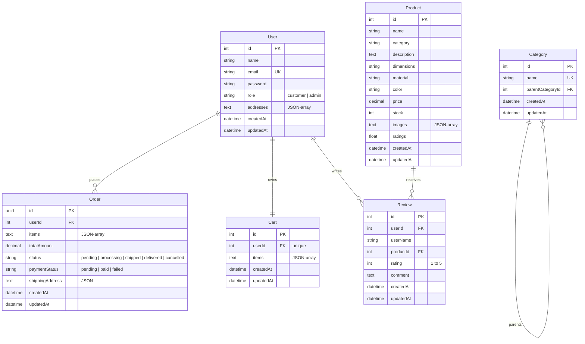

# Furnova – Full-Stack Furniture E-Commerce Platform

Furnova is a fully functional, premium full-stack e-commerce web application specializing in home furniture (beds, chairs, sofas, tables, storage, etc.). It enables customers to browse, search, filter, and purchase items online—while providing administrators with complete inventory management and order control panels.

---

## 1. Architectural Overview

Furnova is designed with a decoupled architecture for maximum speed, security, and scalability:

```
┌─────────────────────────────────────────────────────────┐
│                    Vite + React SPA                     │
│    (Custom CSS Design System, Lucide Icons, Router)     │
└────────────────────────────┬────────────────────────────┘
                             │ (HTTPS REST API Requests)
                             ▼
┌─────────────────────────────────────────────────────────┐
│                   Node.js Express API                   │
│   (JWT auth, CSRF validation, HTTP-Only cookies, CORS)  │
└────────────────────────────┬────────────────────────────┘
                             │
                             ▼
┌─────────────────────────────────────────────────────────┐
│                    SQLite Database                      │
│             (Sequelize ORM Relational DB)               │
└─────────────────────────────────────────────────────────┘
```

- **Frontend client**: Built with **React** and **Vite**, utilizing a custom CSS design system with HSL variables, fluid layouts, glassmorphic banners, and micro-animations.
- **Backend API server**: Powered by **Express.js**, enforcing loopback binding (`127.0.0.1`), CORS policies, strict HTTP headers, and stateless authentication.
- **Database layer**: Relational **SQLite** managed using **Sequelize ORM**, storing items in a self-contained local file (`database.sqlite`).

---

## 2. Database Schema Diagram

The database structure is relational and comprises six core tables:



---

## 3. Setup & Seeding Instructions

### Prerequisites
- Node.js (v16.0.0 or higher)
- npm (v8.0.0 or higher)

### Installation Steps

1. **Clone or Open the Directory**
   Ensure all source folders are in place.

2. **Install All Dependencies**
   Run the following script at the root directory to install root, backend, and frontend packages automatically:
   ```bash
   npm run install:all
   ```

3. **Populate the Database**
   Pre-populate the SQLite database with catalog categories and 10 premium furniture items by running:
   ```bash
   npm run seed --prefix server
   ```

4. **Launch Dev Servers**
   Run the following command at the root directory to start the frontend Vite client and the backend Express API concurrently:
   ```bash
   npm run dev
   ```
   - Vite Client: `http://localhost:5173`
   - Express Server: `http://127.0.0.1:5000`

---

## 4. RESTful API Documentation

### Authentication (`/api/auth`)
| Method | Endpoint | Auth Required | Description |
|---|---|---|---|
| POST | `/api/auth/register` | None | Register a user (first user gets the `admin` role). Sets JWT cookie. |
| POST | `/api/auth/login` | None | Logs in an user. Sets JWT cookie and returns CSRF token. |
| POST | `/api/auth/logout` | None | Clears JWT cookie. |
| GET | `/api/auth/me` | JWT Cookie | Retrieves profile info and propagates a fresh CSRF token. |

### Product Catalog (`/api/products`)
| Method | Endpoint | Auth Required | Description |
|---|---|---|---|
| GET | `/api/products` | None | Fetch catalog. Supports filtering by `category`, `search`, `minPrice`/`maxPrice`, `material`, `color`, and `sortBy`. |
| GET | `/api/products/:id` | None | Fetch a product's details and its reviews. |
| POST | `/api/products` | JWT (Admin) + CSRF | Create a new furniture product. |
| PUT | `/api/products/:id` | JWT (Admin) + CSRF | Update product details or stock capacity. |
| DELETE | `/api/products/:id` | JWT (Admin) + CSRF | Remove product. |

### Categories (`/api/categories`)
| Method | Endpoint | Auth Required | Description |
|---|---|---|---|
| GET | `/api/categories` | None | Get all category trees including subcategories. |
| POST | `/api/categories` | JWT (Admin) + CSRF | Create a new parent or subcategory. |
| DELETE | `/api/categories/:id` | JWT (Admin) + CSRF | Delete a category. |

### Cart Management (`/api/cart`)
| Method | Endpoint | Auth Required | Description |
|---|---|---|---|
| GET | `/api/cart` | JWT Cookie | Retrieve active user's cart contents. |
| POST | `/api/cart` | JWT + CSRF | Add item or update quantity. |
| DELETE | `/api/cart/items/:productId` | JWT + CSRF | Delete an item from the cart. |
| POST | `/api/cart/clear` | JWT + CSRF | Empty the cart. |

### Order Processing (`/api/orders`)
| Method | Endpoint | Auth Required | Description |
|---|---|---|---|
| GET | `/api/orders` | JWT Cookie | Retrieve logged-in customer's orders history. |
| GET | `/api/orders/all` | JWT (Admin) | Retrieve all orders in the store. |
| POST | `/api/orders` | JWT + CSRF | Creates order from cart items, checks stock levels, and deducts inventory. |
| PUT | `/api/orders/:id/status` | JWT (Admin) + CSRF | Update order status (`pending`, `shipped`, etc.). |
| PUT | `/api/orders/:id/payment` | JWT + CSRF | Update order payment status. |

### Reviews (`/api/reviews`)
| Method | Endpoint | Auth Required | Description |
|---|---|---|---|
| GET | `/api/reviews/product/:productId` | None | Fetch reviews for a product. |
| POST | `/api/reviews` | JWT + CSRF | Submit a rating (1-5) and review comment, re-calculating product ratings. |

### Stripe Payment Simulation (`/api/payments`)
| Method | Endpoint | Auth Required | Description |
|---|---|---|---|
| POST | `/api/payments/charge` | JWT + CSRF | Simulates Stripe charge using tokenization. Use cards ending in `4002` to test declines. |

---

## 5. Running Tests

Furnova includes a test suite covering endpoints, authentication controls, and validation requirements. To run:
```bash
npm run test
```

---

## 6. Security Features

- **SQL Injection Prevention**: Built on Sequelize ORM parameterized operations. Unsanitized strings are never concatenated directly.
- **XSS Protections**: Native JSX escaping handles rendering. Non-secure frontend elements (`innerHTML`) are excluded.
- **Session Protections**: JSON Web Tokens are stored in secure, browser-isolated `HttpOnly`, `Secure`, `SameSite=Lax` cookies.
- **CSRF Safeguards**: Compares the custom `x-csrf-token` header against the encrypted JWT payload for all state-changing operations.
- **Input Constraints**: Requires passwords to be at least 8 characters. Restricts rating bounds (1 to 5) and quantities.
- **Loopback Binding**: Forces backend server to listen on local loopback `127.0.0.1`, blocking raw external port exposures.
